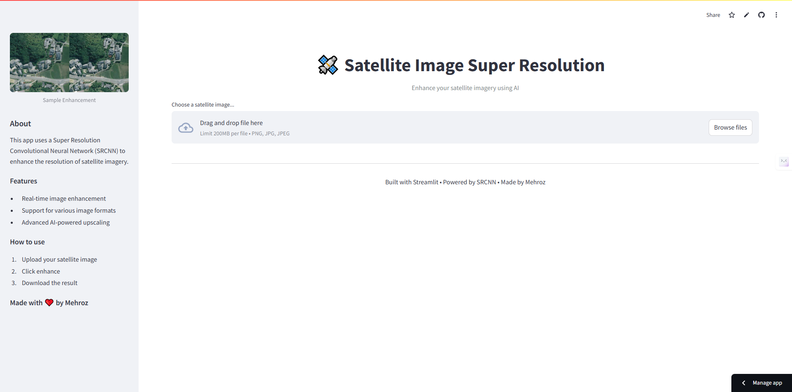
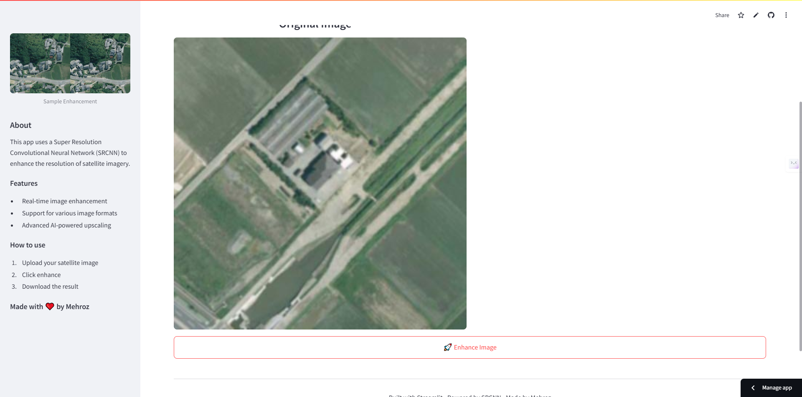
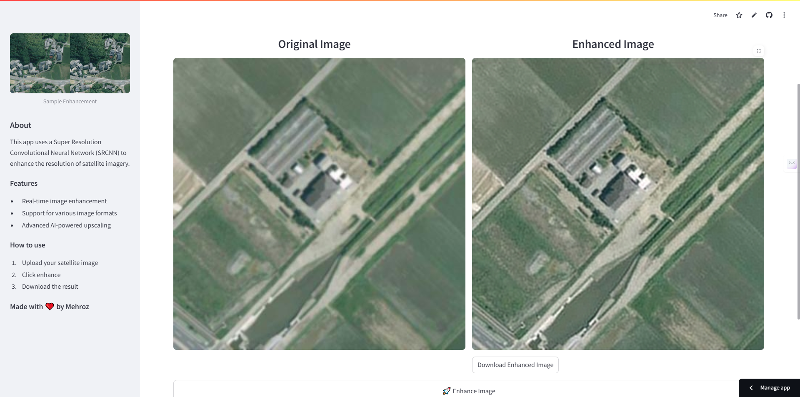

# SuperResolutionSatellite

SuperResolutionSatellite is a deep learning project that enhances the resolution of satellite imagery using a Super Resolution Convolutional Neural Network (SRCNN). It provides both a Streamlit web application for real-time image enhancement and a command-line interface for training, evaluating, and running inference.

## Features

- **Real-Time Image Enhancement:** Use the Streamlit app ([app.py](app.py)) to upload and enhance satellite images.
- **Model Training & Evaluation:** Train, test, and run model inference using the CLI tool ([srcnn.py](srcnn.py)).
- **Data Preprocessing:** Automatically generate training and testing samples from large images ([preprocess.py](preprocess.py)).
- **Utility Functions:** Data loading and directory management functionalities in ([util.py](util.py)).

## Requirements

- Python 3.7+
- TensorFlow 2.x / Keras
- Streamlit
- Other dependencies listed in [requirements.txt](requirements.txt)

## Installation

1. **Clone the Repository:**
   ```sh
   git clone <repository-url>
   cd SuperResolutionSatellite
   ```

2. **Install Dependencies:**
   ```sh
   pip install -r requirements.txt
   ```

3. **Download Model Weights:**
   Place the pre-trained model weights (e.g., weights.h5 or weights2.h5) into the models directory.

## Usage

### Streamlit App

Launch the app to enhance your satellite images:

```sh
streamlit run app.py
```

- **How It Works:**  
  Upload an image, then click on "🚀 Enhance Image". The app displays the original and enhanced images side-by-side with a download option for the result.

### Command Line Interface

Use the CLI tool in srcnn.py for these actions:

- **Train the Model:**
  ```sh
  python srcnn.py --action train --data_path data --model_path models/weights2.h5
  ```

- **Test the Model:**
  ```sh
  python srcnn.py --action test --data_path data --model_path models/weights2.h5
  ```

- **Run Inference:**
  ```sh
  python srcnn.py --action run --data_path data --model_path models/weights2.h5 --output_path results
  ```

## Data Preprocessing

The preprocessing routines in preprocess.py split large images, generate dataset samples, and create corresponding downsampled versions for training.  
- Place your high-resolution images in the `images/` directory.
- The scripts generate subdirectories for raw, training, and testing data.

## App Screenshots

View screenshots of the application:

- 
- 
- 

*Ensure your `/screenshots` folder contains these images.*

## File Structure

```plaintext
app.py
data/
  └── images/
models/
  ├── weights.h5
  └── weights2.h5
preprocess.py
README.md
srcnn.py
util.py
```

## Troubleshooting

- Ensure all dependencies are installed correctly using:
  ```sh
  pip install -r requirements.txt
  ```
- Verify your Python version is 3.7 or above.
- Check that the model weights are placed in the correct directory.

## Contributing

Contributions are welcome! Please follow these steps:
- Fork the repository.
- Create a feature branch: `git checkout -b feature/YourFeature`.
- Commit your changes and push to your branch.
- Open a pull request with a clear description of your changes.

## License

This project is licensed under the [MIT License](https://opensource.org/licenses/MIT).

## Acknowledgments

- **Streamlit:** For the intuitive web interface.
- **TensorFlow/Keras:** For the underlying deep learning framework.
- **SRCNN Paper:** For inspiring the super resolution approach ([Link to paper](https://arxiv.org/pdf/1501.00092.pdf)).
- **WarrenGreen:** For contributions to the training code ([GitHub](https://github.com/WarrenGreen/srcnn)).

## Future Work

- Implement automated model optimization.
- Add more robust error handling in the CLI.
- Expand the web app features for batch processing.
